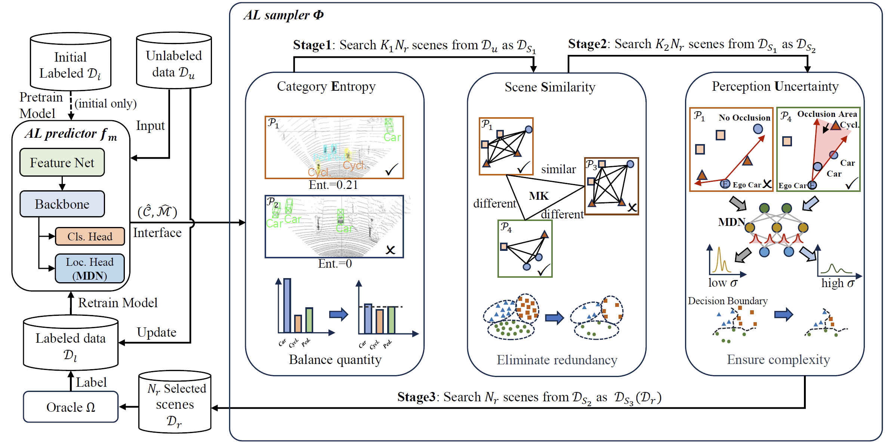

# TSceneJAL
Code release for the paper **TSceneJAL: Joint Active Learning of Traffic Scenes for 3D Object Detection**


# Introduction
**TSceneJAL** is an active learning framework designed to reduce the annotation cost by selecting the most informative samples for annotation.

This repo is an implementation of our **JST** framework with PyTorch (v1.8.0). The implementation is based on [OpenPCDet](https://github.com/open-mmlab/OpenPCDet) and [CRB-active-3Ddet](https://github.com/Luoyadan/CRB-active-3Ddet).

# Benchmark
KITTI Experiment:

|  Method   | mAP_3D<br/>(Easy) | mAP_3D<br/>(Mod.) | mAP_3D<br/>(Hard) | mAP_3D<br/>(Easy) | mAP_3D<br/>(Mod.) | mAP_3D<br/>(Hard) |                                                                                       Checkpoint                                                                                       |
|:---------:|:-----------------:|:-----------------:|:-----------------:|:-----------------:|:-----------------:|:-----------------:|:--------------------------------------------------------------------------------------------------------------------------------------------------------------------------------------:|
|  Random   |       70.68       |       58.75       |       55.28       |       75.19       |       64.40       |       60.98       |                                            [model](https://drive.google.com/drive/folders/1MCepa2eav2tcmaXgS_7pFjIowX1n9ucN?usp=drive_link)                                            |
| TSceneJAL |       73.21       |       61.32       |       57.54       |       77.51       |       66.91       |       63.23       |                                            [model](https://drive.google.com/drive/folders/13WxvyjiSiA0crxTHShGfyhs3uHqY1oty?usp=drive_link)                                            |

Lyft Experiment:

|  Method   | mAP_3D<br/>(Easy) | mAP_3D<br/>(Mod.) | mAP_3D<br/>(Hard) | mAP_3D<br/>(Easy) | mAP_3D<br/>(Mod.) | mAP_3D<br/>(Hard) |                                                                                       Checkpoint                                                                                       |
|:---------:|:-----------------:|:-----------------:|:-----------------:|:-----------------:|:-----------------:|:-----------------:|:--------------------------------------------------------------------------------------------------------------------------------------------------------------------------------------:|
|  Random   |       30.62       |       27.87       |       27.27       |       34.32       |       32.58       |       31.95       |                                            [model](https://drive.google.com/drive/folders/1VdE3vlrzG7kHgEOiPW_2hbsJ--W-piJv?usp=drive_link)                                            |
| TSceneJAL |       32.49       |       29.56       |       29.26       |       36.66       |       34.91       |       34.49       |                                            [model](https://drive.google.com/drive/folders/11s_Gk3L79hq-H8HmEsYUfLnxIbX9K8vi?usp=drive_link)                                            |

# Installation
All the codes are tested in the following environment:

- python 3.7
-  PyTorch 1.9.0
- CUDA 11.7

a. Clone this repository

```
git clone https://github.com/guangyaooo/JointRCNN.git
```

 b. Install the dependent libraries as follows:

```
pip install -r requirements.txt 
```

c. Install other dependencies

```
python setup.py develop
```

# Data Preparation
We evaluate our method on two datasets:

- [KITTI object detection 3D dataset](http://www.cvlibs.net/datasets/kitti/eval_object.php?obj_benchmark=3d)
- [Lyft Level 5 dataset v1.02](https://self-driving.lyft.com/level5/data/)

Please refer to [3D_adapt_auto_driving](https://github.com/cxy1997/3D_adapt_auto_driving#usage) to prepare the KITTI and Lyft datasets. The Lyft dataset will be transformed to the KITTI format in that repo.

The final datasets will be organized as the following structure:

<pre>
dataset_path/
    | kitti/               # KITTI object detection 3D dataset
    	| ImageSets/
    		| train.txt		# training and validation split
    		| val.txt
    	|training/
    		| calib
    		| image_2
    		| label_2
    		| velodyne
    | lyft_kf/               # Lyft object detection 3D dataset(in KITTI format)
    	| ImageSets/
    		| train.txt		# training and validation split
    		| val.txt
    	|training/
    		| calib
    		| image_2
    		| label_2
    		| velodyne
</pre>

Next, create a softlink in the root of the Project

```
ln -s dataset_path root/of/the/project/data
```
Build datasets for the TSceneJAL framework


```
python -m pcdet.datasets.kitti.kitti_dataset create_kitti_infos tools/cfgs/dataset_configs/kitti_dataset.yaml
python -m pcdet.datasets.kitti.lyft_kf_dataset create_lyft_infos tools/cfgs/dataset_configs/lyft_kf_dataset.yaml
```

# Active Learning Tranining
a. Set the active learning config
```
cd tools/cfgs/kitti_models/pointpillar_box_mdn_com3.yaml 
# if train Lyft, change the path to tools/cfgs/lyft_models
```
```yaml
# set the config in yaml file
ACTIVE_TRAIN:
    TOTAL_LOOP: 5          # total loop of active learning
    INIT_SET_LEN: 200      # initial set size
    SEARCH_NUM_EACH: 200   # number of samples to search in each loop
    LOOP_EPOCHS: 50        # number of epochs in fisrt loop
    EPOCH_STEP: 2          # step of epoch in each loop （eg. 50, 52, 54, 56, 58)
    K1: 3                  # number of samples(K1*SEARCH_NUM_EACH) selected in first stage 
    K2: 2.5                # number of samples(K2*SEARCH_NUM_EACH) selected in second stage
```

b. Do active learning training

To train the model with the TSceneJAL framework, you can run the following command:
```
cd tools
python al_train.py --cfg_file cfgs/kitti_models/pointpillar_box_mdn_com3.yaml --batch_size 2 --workers 4 --rules 14 --extra_tag tag_name --group_name group_name
```

The ```--rules``` parameter is used to specify the active learning strategy. Rules are defined as follows:

|     Rules     |  Code  |
|:-------------:|:------:|
|    Random     |   0    |
|  Confidence   |   11   |
|  MC Dropout   |   6    |
|     Badge     |   20   |
|    Coreset    |   21   |
|      Crb      |   22   |
| **TSceneJAL** | **14** |

c. Results

The results path root is:
```
root/of/the/project/output/kitti[lyft]_models/config_name/group_name/tag_name
```

The result file in path is organized as follows:
<pre>
results/path/root/
    | ckpt/               
    	| loop_0  # checkpoint in each loop of active learning
    	| loop_1
    	   ...
    | pool/
        | pool_loop_0.npy  # the idx of selected frames
        | pool_loop_1.npy
           ...
    | tensorboard/
</pre>

# Evaluation

To evaluate the models, run the following command:
```
cd tools
python al_test.py --cfg_file cfgs/kitti_models/pp_box_mdn/pointpillar_box_mdn_com3.yaml   --root_dir results/path/root --start_loop 0 --end_loop 5
```

If you only want to evaluate one loop(e.g. The final loop), set ```start_loop```= ```end_loop```= specific loop num

# Acknowledgement
Our code is based on  [OpenPCDet](https://github.com/open-mmlab/OpenPCDet) and [CRB-active-3Ddet](https://github.com/Luoyadan/CRB-active-3Ddet). Thanks for their awesome codebase.

